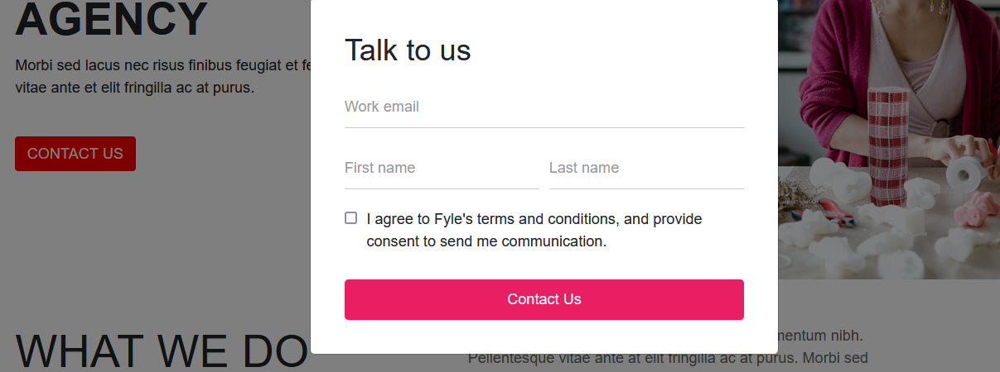
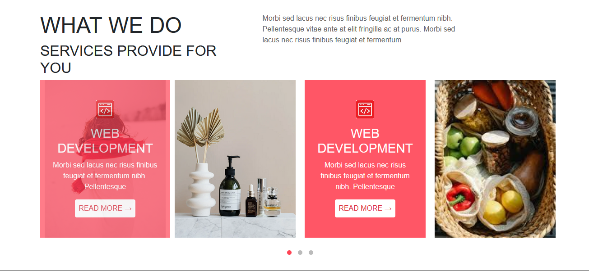
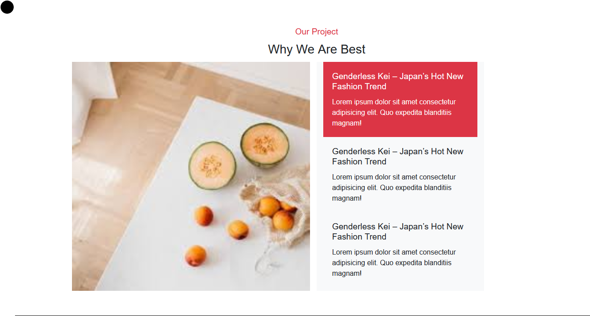
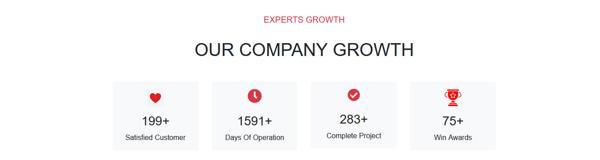

# Digital Marketing Agency Website

This project showcases a web Development company website built with HTML, Bootstrap, and custom CSS and Jquery. The website features various sections including an introductory section, a services slider, and a project showcase.

## Features

- **Introductory Section**: Displays the company’s title, a brief description, and a contact button.
- **Services Slider**: Showcases different services with images, descriptions, and a "Read More" button.
- **Project Showcase**: Highlights the company's projects and achievements.
- **Contact Us Modal**: A modal form to allow users to contact the agency.

## Files

- `index.html`: Main HTML file.
- `styles.css`: Custom CSS file for styling.
- `scripts.js`: JavaScript file for interactive features.
- `README.md`: Documentation file.

## Technologies Used

- HTML5
- Bootstrap 4.5.2
- Font Awesome 5.15.4
- Custom CSS

## Getting Started

1. **Clone the repository**:
    ```sh
    git clone https://github.com/Rudra-Maity/web-dev-assign.git
    ```

2. **Open the project directory**:
    ```sh
    cd web-dev-assign
    ```

3. **Open `index.html` in your web browser**:
    ```sh
    open index.html
    ```

## Test Case

To verify the implementation of the HTML page, use the following test case:

### Test Case: Verify Contact Us Modal Form

**Step 1**: Open the `index.html` file in a web browser.

**Step 2**: Locate the "CONTACT US" button in the introductory section and click it.

**Expected Result**: A modal form should appear, containing the following fields:
- Email input field labeled "Work email"
- First name input field labeled "First name"
- Last name input field labeled "Last name"
- Checkbox labeled "I agree to Fyle's terms and conditions, and provide consent to send me communication."

**Step 3**: Fill in the fields with the following data:
- Email: `test@example.com`
- First name: `John`
- Last name: `Doe`
- Check the checkbox.

**Step 4**: Submit the form by clicking the "Contact Us" button within the modal.

**Expected Result**: The form data should be sent to the specified form handler URL (https://getform.io/f/bejyjrna). Check the network requests in the browser’s developer tools to ensure the form submission is correct.

**Step 5**: Verify the form fields' validation:
- Leave the email field empty and try to submit. The form should display a validation error.
- Leave the first name or last name field empty and try to submit. The form should display a validation error.

**Step 6**: The slider:
- Here slider is changed 7s interval and also three dots are changed accordingly.
- when you hover then read more text will appear.
- 
**Step 7**: The Image changing:
- when you click on a card then the left side image will be changed.
**Step 8**: The Section cards:
- when you hover on a card then the card will be highlite.
- 
## Screenshots
### Introductory Section


### contact form



### Services Slider



### Project Showcase



### Growth and Customer feedback




## License

This project is licensed under the MIT License. See the [LICENSE](LICENSE) file for details.
